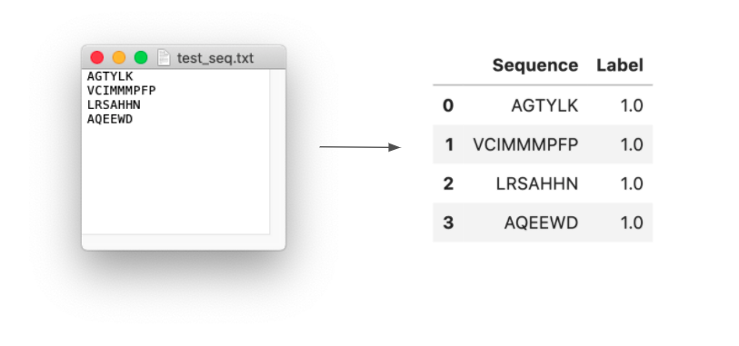
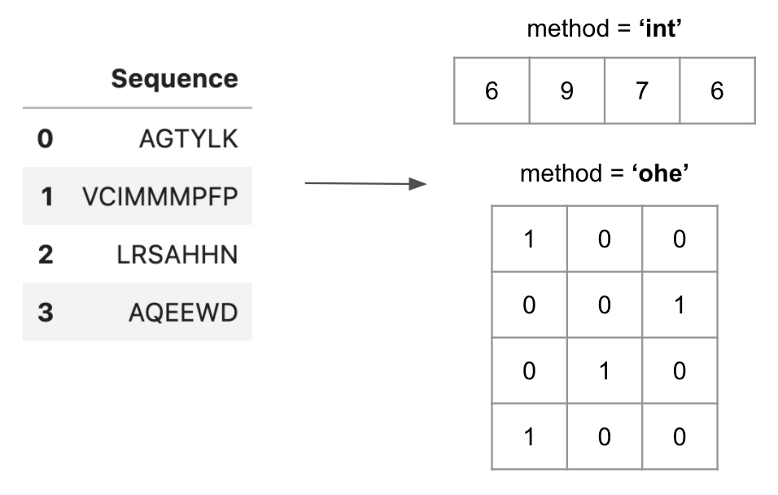
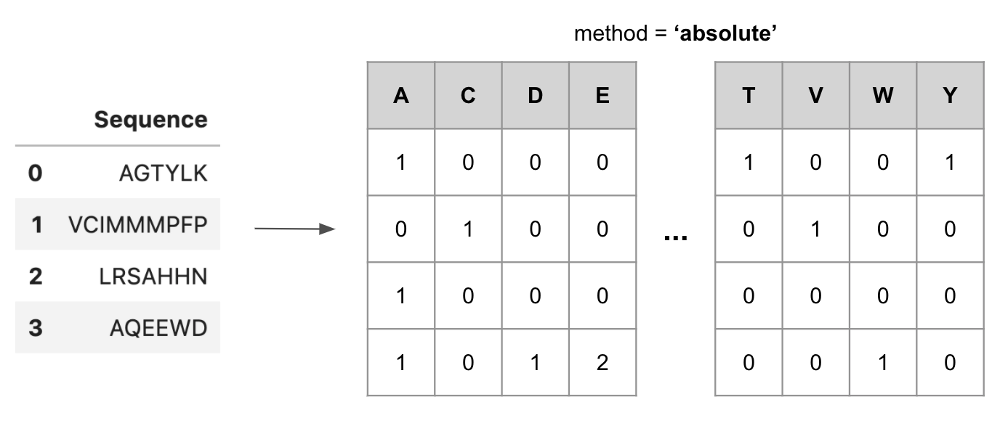
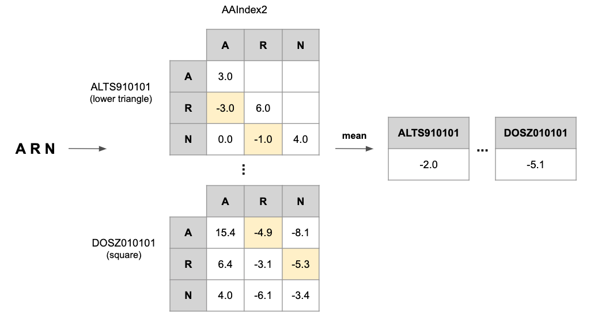
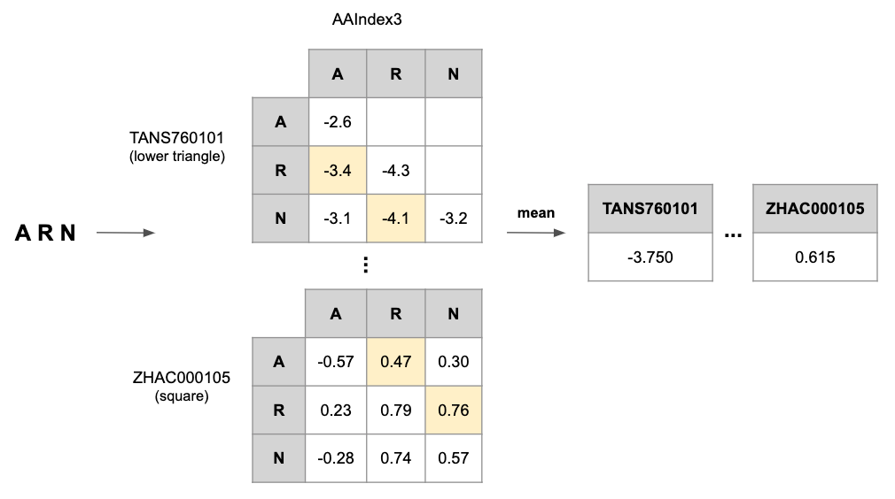
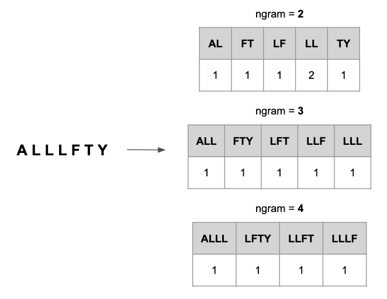

[](https://travis-ci.org/tadorfer/ProtLearn)
[](https://pypi.org/project/protlearn/)
[](https://img.shields.io/pypi/pyversions/ProtLearn)
[](https://lbesson.mit-license.org/)
[](https://pypistats.org/packages/protlearn)

# protlearn

protlearn is a Python module for preprocessing amino acid sequences (i.e. 
proteins and peptides) and subsequent feature engineering, both of which are
crucial steps to take prior to classification or regression problems.

The module is distributed under the MIT license and is being maintained by
Thomas Dorfer.

## Installation

### Dependencies

- NumPy 
- Pandas 
- scikit-learn

### User Installation

```
$ pip install protlearn
```

## Documentation

Currently, protlearn is comprised of two preprocessing functions and six 
feature engineering functions.

### Preprocessing

- <i>txt_to_df</i>
- <i>integer_encoding</i>

#### txt_to_df

When working with protein or peptide sequences, the data almost always comes in
form of raw .txt files containing these sequences (typically one per row). 

This function converts these sequences into a Python-friendly Pandas DataFrame
with one column containing the sequences ['Sequence'] and a second column 
containing their corresponding class ['Label'] (this could correspond to the
protein family the sequence belongs, or whether a peptide is immunogenic or
not, etc.).

<b>Example:</b>

```python
df = txt_to_df(test_seq.txt, label=1)
```

<p align="center">
  
</p>

#### integer_encoding

Machine learning algorithms can only handle numerical inputs. Therefore, the 
amino acid sequences need to be converted into numerical information, which is
achieved in the form of integers. 

This function converts amino acids of proteins or peptides into corresponding
integer values between 1-20. Zero, in this case, is reserved for padding these
sequences at the end to make them conform to a universal length (i.e. the 
length of the longest sequence in the dataset).

<b>Example:</b>

```python
enc = integer_encode(df, padding=True)
```

<p align="center">
  
</p>

### Feature engineering

- <i>length</i>
- <i>composition</i>
- <i>aaindex1</i>
- <i>aaindex2</i>
- <i>aaindex3</i>
- <i>ngram_composition</i>

#### length

This function returns an n-dimensional array containing the lengths of all
sequences. The method can also be set to 'ohe', short for one-hot-encoding,
which leads to the generation of an array with n rows and the number of columns
corresponding to the longest sequence.

<b>Example:</b>

```python
lengths = length(df)
```

<p align="center">
  
</p>

#### composition

This function returns an array of shape (n, 20) containing the absolute or
relative frequencies of each amino acid that the sequence is comprised of.

<b>Example:</b>

```python
comp = composition(df, method='absolute')
```

<p align="center">
  
</p>

#### aaindex1

This function computes the physicochemical properties of each amino acid 
comprising the sequence and returns the mean of each amino acid index per
sequence.

<b>Example:</b>

```python
aand1 = aaindex1(df, standardize='none')
```

<p align="center">
  
</p>

#### aaindex2

This function computes the substitution matrices of all amino acids of a 
sequence and returns the mean of all substitution scores per sequence.

<b>Example:</b>

```python
aaind2 = aaindex2(df, standardize='none')
```

<p align="center">
  
</p>

#### aaindex3

This function computes the pairwise contact potentials between all amino acids
of a sequence and returns the mean of all contact potentials per sequence.

<b>Example:</b>

```python
aaind3 = aaindex3(df, standardize='none')
```

<p align="center">
  
</p>

#### ngram_composition

This function computes the di-, tri-, or quadpeptide composition of any given
amino acid sequence.

<b>Example:</b>

```python
ngram = ngram_composition(df)
```

<p align="center">
  
</p>

## Authors

This package is maintained by [Thomas Dorfer](https://github.com/tadorfer)

## License

This package is licensed under the [MIT License](https://github.com/tadorfer/ProtLearn/blob/master/LICENSE).