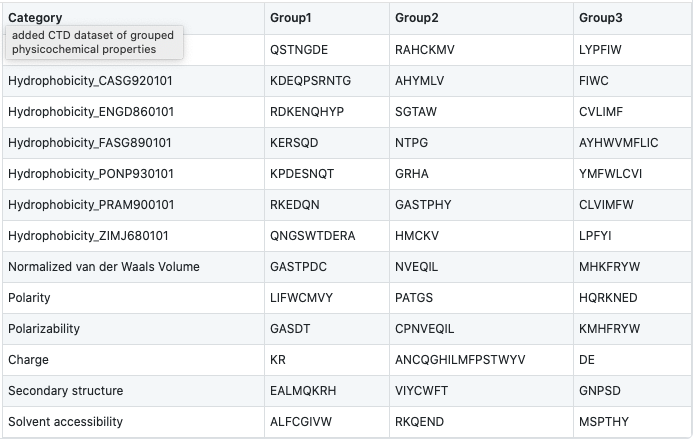
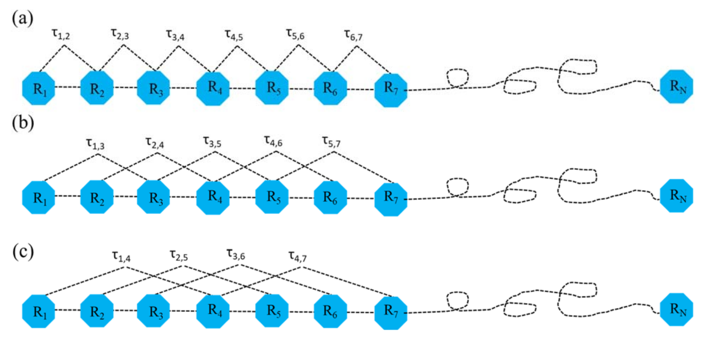

.. _feature_extraction:
.. |br| raw:: html

    

Feature Extraction 
==================

length 
------

.. code-block:: text

    protlearn.features.length(X, *, method='int')

Sequence length in amino acids.

The number of amino acids that a protein or peptide is comprised of will be 
counted and returned as either an integer (single sequence), array of 
integers, or a one-hot-encoded array.

Parameters
##########

X: string, fasta, or a list thereof 
    Dataset of amino acid sequences.

method: string, default='int'
    'int' : interval data |br|
    'ohe' : one-hot encoded data

Returns
#######

arr: int or ndarray of shape (n_samples, ) or (n_samples, n_unique_lengths) 
    Array containing sequence lengths.

Examples
########

.. code-block:: python

    >>> from protlearn.features import length
    >>> seqs = ['ARKLY', 'EERKPGL', 'LLYPGP']
    >>> l_int = length(seqs)
    >>> l_int
    array([5, 7, 6])
    >>> l_ohe = length(seqs, method='ohe')
    array([[1., 0., 0.],
           [0., 0., 1.],
           [0., 1., 0.]])

aac 
---

.. code-block:: text

    protlearn.features.aac(X, *, method='relative', start=1, end=None)

Amino acid composition.

This function returns the frequency of amino acids for each sequence in the dataset. 

`aac` is calculated as follows:

.. math::

   aac(i) = \frac{ n_i }{N}

where *i* denotes the 20 amino acid residues, *n*\ :sub:`i` \ is the frequency of each 
residue i, and *N* is the total number of residues in the sequence.

Parameters
##########

X: string, fasta, or a list thereof 
    Dataset of amino acid sequences.

method: string, default='relative'
    'absolute' : absolute amino acid composition |br|
    'relative' : relative amino acid composition

start: int, default=1
    Determines the starting point of the amino acid sequence. This number is based on one-based indexing.

end: int, default=None
    Determines the end point of the amino acid sequence. Similarly to start, this number is based on one-based indexing.

Returns
#######

arr:  ndarray of shape (n_samples, n_unique_amino_acids)
    Array containing the amino acid composition.

amino_acids: string
    Corresponds to the columns (amino acids) in arr.

Examples
########

.. code-block:: python

    >>> from protlearn.features import aac
    >>> seqs = ['ARKLY', 'EERKPGL']
    >>> comp, aa = aac(seqs)
    >>> comp
    array([[0.2       , 0.        , 0.        , 0.2       , 0.2       ,
            0.        , 0.2       , 0.2       ],
           [0.        , 0.28571429, 0.14285714, 0.14285714, 0.14285714,
            0.14285714, 0.14285714, 0.        ]])
    >>> aa
    'AEGKLPRY'

Note that columns containing all zeros have been removed from the final array.

aaindex1
--------

.. code-block:: text

    protlearn.features.aaindex1(X, *, standardize='none', start=1, end=None)

AAIndex1-based physicochemical properties.

AAindex1 ver.9.2 (release Feb, 2017) is a set of 20 numerical values 
representing various physicochemical and biological properties of amino 
acids. Currently, it contains 566 indices, of which 553 contain no NaNs. 
The indices will be collected for each amino acid in the sequence, 
then averaged across the sequence. 

`aaindex1` is calculated as follows:

.. math::

   aaindex1(i) = \frac{ \sum_{n=1}^{N}AAindex_i (aa_n) }{N}

where *i* denotes the 566 AAIndex1 indices, *aa*\ :sub:`n` \ denotes the amino acid at 
position *n*, and *N* is the total number of residues in the sequence.

Parameters
##########

X: string, fasta, or a list thereof 
    Dataset of amino acid sequences.

standardize: string, default='none'
    'none' : unstandardized index matrix will be returned |br|
    'zscore' : index matrix is standardized to have a mean of 0 and standard deviation of 1. |br|
    'minmax' : index matrix is normalized to have a range of [0, 1].

start: int, default=1
    Determines the starting point of the amino acid sequence. This number is based on one-based indexing.

end: int, default=None
    Determines the end point of the amino acid sequence. Similarly to start, this number is based on one-based indexing.

Returns
#######

arr: ndarray of shape (n_samples, 553-566) 
    Array containing the AAIndex1 physicochemical properties.

desc: list of length 553-566
    Corresponds to the columns (AAIndices) in arr.

Notes
#####

Columns (indices) containing NaNs will be removed. Thus, the resulting index
matrix will have a column size between 553-566.

References
##########

- Nakai, K., Kidera, A., and Kanehisa, M.; Cluster analysis of amino acid indices for prediction of protein structure and function. Protein Eng. 2, 93-100 (1988). [PMID:3244698]
- Tomii, K. and Kanehisa, M.; Analysis of amino acid indices and mutation matrices for sequence comparison and structure prediction of proteins. Protein Eng. 9, 27-36 (1996). [PMID:9053899]
- Kawashima, S., Ogata, H., and Kanehisa, M.; AAindex: amino acid index database. Nucleic Acids Res. 27, 368-369 (1999). [PMID:9847231]
- Kawashima, S. and Kanehisa, M.; AAindex: amino acid index database. Nucleic Acids Res. 28, 374 (2000). [PMID:10592278]
- Kawashima, S., Pokarowski, P., Pokarowska, M., Kolinski, A., Katayama, T., and Kanehisa, M.; AAindex: amino acid index database, progress report 2008. Nucleic Acids Res. 36, D202-D205 (2008). [PMID:17998252]

Examples
########

.. code-block:: python

    >>> from protlearn.features import aaindex1
    >>> seqs = ['ARKLY', 'EERKPGL']
    >>> aaind, inds = aaindex1(seqs, standardize='zscore')
    >>> aaind.shape
    (2, 553)
    >>> len(inds)
    553

ngram
-----

.. code-block:: text

    protlearn.features.ngram(X, *, n=2, method='relative', start=1, end=None)

N-gram composition.

This function computes the di- or tripeptide composition of amino acid 
sequences. Therefore, the function parameter *n* can only take on 
the arguments 2 and 3 - otherwise, it will raise a ValueError.

`ngram` is calculated as follows:

.. math::

   di(i, j) = \frac{ N_{ij} }{N-1} \quad i,j = 1, 2, ..., 20.

.. math::

   tri(i, j, k) = \frac{ N_{ijk} }{N-2} \quad i,j,k = 1, 2, ..., 20.

where *N*\ :sub:`ij` \ and *N*\ :sub:`ijk` \ denote the di- and tripeptides 
comprised by amino acids *ij* and *ijk*, respectively. *N* denotes the total 
sequence length.

Parameters
##########

X: string, fasta, or a list thereof 
    Dataset of amino acid sequences.
    
n: int, default=2
    Integer denoting the desired n-gram composition. |br|
    2 : dipeptide composition |br|
    3 : tripepitde composition
    
method: string, default='relative'
    'absolute': absolute n-gram composition |br|
    'relative': relative n-gram composition

start: int, default=1
    Determines the starting point of the amino acid sequence. This number is
    based on one-based indexing.

end: int, default=None
    Determines the end point of the amino acid sequence. Similarly to start,
    this number is based on one-based indexing.
    
Returns
#######

arr: ndarray of shape (n_samples, n_unique^n)
    Depending on *n*, the returned array will be of size: |br|
    - (n_samples, 400) for dipeptide composition |br|
    - (n_samples, 8000) for tripeptide composition |br|
    if all possible n-gram combinations are represented.

n-grams: list of length n_unique^n
    List of n-grams corresponding to columns in arr.

Examples
########

.. code-block:: python

    >>> from protlearn.features import ngram
    >>> seqs = ['ARKLY', 'EERKPGL']
    >>> di, ngrams = ngram(seqs, n=2)
    >>> di
    array([[0.25      , 0.25      , 0.25      , 0.25      , 0.        ,
            0.        , 0.        , 0.        , 0.        ],
           [0.        , 0.        , 0.        , 0.16666667, 0.16666667,
            0.16666667, 0.16666667, 0.16666667, 0.16666667]])
    >>> ngrams
    ['AR', 'KL', 'LY', 'RK', 'EE', 'ER', 'GL', 'KP', 'PG']
    >>> tri, ngrams = ngram(seqs, n=3)
    array([[0.33333333, 0.33333333, 0.33333333, 0.        , 0.        ,
            0.        , 0.        , 0.        ],
           [0.        , 0.        , 0.        , 0.2       , 0.2       ,
            0.2       , 0.2       , 0.2       ]])
    >>> ngrams
    ['ARK', 'KLY', 'RKL', 'EER', 'ERK', 'KPG', 'PGL', 'RKP']

entropy
-------

.. code-block:: text

    protlearn.features.entropy(X, *, standardize='none', start=1, end=None)

Shannon entropy.

This function computes the Shannon entropy for each sequence in the 
dataset as follows:

.. math::

   H(X) = -\sum_{i=1}^{20}P(x_i)log_2 P(x_i)

where *i* denotes the 20 amino acids and *P(x*\ :sub:`i`\) denotes the 
probability of a given amino acid in the sequence.

Parameters
##########

X: string, fasta, or a list thereof 
    Dataset of amino acid sequences.

standardize: string, default='none'
    'none' : unstandardized matrix will be returned |br|
    'zscore' : matrix is standardized to have a mean of 0 and standard deviation of 1. |br|
    'minmax' : matrix is normalized to have a range of [0, 1].

start: int, default=1
    Determines the starting point of the amino acid sequence. This number is
    based on one-based indexing.

end: int, default=None
    Determines the end point of the amino acid sequence. Similarly to start,
    this number is based on one-based indexing.

Returns
#######

arr:  ndarray of shape (n_samples,) if len(X) > 1, otherwise float
    Array containing Shannon entropy values for each sequence.

Examples
########

.. code-block:: python

    >>> from protlearn.features import entropy
    >>> seqs = ['ARKLY', 'EERKPGL', 'AAAAAALY']
    >>> ent = entropy(seqs)
    >>> ent
    array([2.32192809, 2.52164064, 0.64020643])

posrich
-------

.. code-block:: text

    protlearn.features.posrich(X, *, position, aminoacid)

Position-specific amino acids.

This function returns a binary vector or matrix in which ones indicate the 
presence of the given amino acid(s) at the specified position(s), and zeros 
indicate their absence. 

Parameters
##########

X: string, fasta, or a list thereof
    Dataset of amino acid sequences.
    
position: int or list
    Integer or list of integers denoting the position(s) in the sequence. 

aminoacid: string or list
    String or list of strings indicating the amino acid(s) of interest.
    
Returns
#######

arr: ndarray of shape (n_samples, ) or (n_samples, n_positions)
    Binary vector/matrix indicating position-specific presence of amino acids.

Notes
#####

The position argument is based on one-based indexing.

Examples
########

.. code-block:: python

    >>> from protlearn.features import posrich
    >>> seqs = ['ARKLY', 'ERNLAPG', 'YRLQLLLY']   
    >>> pos_single = posrich(seqs, position=4, aminoacid='L')
    >>> pos_single
    array([1., 1., 0.])
    >>> pos_multiple = posrich(seqs, position=[2,3,4], aminoacid=['R','N','L'])
    array([[1., 0., 1.],
           [1., 1., 1.],
           [1., 0., 0.]])

motif
-----

.. code-block:: text

    protlearn.features.motif(X, pattern, *, start=1, end=None)

Sequence motifs.

This function returns a binary vector indicating the presence of a specified 
amino acid sequence motif.

Parameters
##########

X: string, fasta, or a list thereof 
    Dataset of amino acid sequences.
    
pattern: string
    Represents the sequence motif. |br|
    x --> any amino acid |br|
    [XY] --> X or Y |br|
    {X} --> any amino acid except X

start: int, default=1
    Determines the starting point of the amino acid sequence. This number is
    based on one-based indexing.

end: int, default=None
    Determines the end point of the amino acid sequence. Similarly to start,
    this number is based on one-based indexing.

Returns
#######

arr:  ndarray of shape (n_samples,)
    Binary vector indicating the presence of the motif in sequences.

Examples
########

.. code-block:: python

    >>> from protlearn.features import motif
    >>> seqs = ['AARKYLL', 'LELCDPGPG', 'RAAANCDD']  
    >>> pattern1 = pattern = 'AAx[KC]'
    >>> m1 = motif(seqs, pattern1)
    >>> m1
    array([1., 0., 1.])
    >>> pattern2 = 'xxC[DA]xx{Y}'
    >>> m2 = motif(seqs, pattern2)
    >>> m2
    array([0., 1., 0.])    

Based on the example above, 'pattern1' is interpreted as follows:
Two consecutive amino acids 'A', followed by any amino acid, followed by
either a 'K' or a 'C'. 

Likewise, pattern2 is interpreted as follows:
Any two consecutive amino acids, followed by a 'C', followed by either a 'D'
or an 'A', followed by any two amino acids, followed by any amino acid
except 'Y'.

atc 
---

.. code-block:: text

    protlearn.features.atc(X, *, method='relative', start=1, end=None)

Atomic and bond composition.

This function returns the sum of atomic and bond compositions for each 
amino acid sequence. The atomic features are comprised of five atoms 
(C, H, N, O, and S), and the bond features are comprised of total bonds, 
single bonds, and double bonds.

`atc` is calculated as follows:

.. math::

    atoms(i) = \frac{ n_i }{N}

where *i* denotes the type of atoms, *n*\ :sub:`i` \ is the total number of 
atoms of type *i*, and *N* is the total number of atoms in the sequence.

.. math::

    bonds(j) = n_j

where *j* denotes the type of bond and *n*\ :sub:`j` \ is the total number of 
bonds of type *j*.

Parameters
##########

X: string, fasta, or a list thereof 
    Dataset of amino acid sequences.

method: string, default='relative'
    'absolute': absolute atomic composition |br|
    'relative': relative atomic composition

start: int, default=1
    Determines the starting point of the amino acid sequence. This number is
    based on one-based indexing.

end: int, default=None
    Determines the end point of the amino acid sequence. Similarly to start,
    this number is based on one-based indexing.

Returns
#######

arr_atoms:  ndarray of shape (n_samples, 5)
    Array containing atomic compositions.

arr_bonds: ndarray of shape (n_samples, 3)
    Array containing bond compositions.

Notes
#####

The ``method`` argument only applies to the atomic composition, not
the bond composition.

References
##########

- Kumar, R., Chaudhary, K., Singh Chauhan, J. et al. An in silico platform for predicting, screening and designing of antihypertensive peptides. Sci Rep 5, 12512 (2015). https://doi.org/10.1038/srep12512

Examples
########

.. code-block:: python

    >>> from protlearn.features import atc
    >>> seqs = ['ARKLY', 'EERKPGL', 'AAAAAALY']
    >>> atoms, bonds = atc(seqs)
    >>> atoms
    array([[0.27522936, 0.5412844 , 0.08256881, 0.10091743, 0.],
           [0.25547445, 0.53284672, 0.08029197, 0.13138686, 0.],
           [0.26612903, 0.53225806, 0.06451613, 0.13709677, 0.]])
    >>> bonds
    array([[105.,  96.,   9.],
           [131., 121.,  10.],
           [117., 106.,  11.]])

binary 
------

.. code-block:: text

    protlearn.features.binary(X, *, padding=True, start=1, end=None)

Binary profile pattern.

This function returns the binary profile pattern for each amino acid 
sequence in the dataset. The output array is therefore very sparse, as each 
amino acid is represented by a 20-dimensional vector with only one non-zero 
value.

Parameters
##########

X: string, fasta, or a list thereof 
    Dataset of amino acid sequences.

padding: bool, default=True
    Pad sequences of unequal lengths with zeros at the posterior end.

start: int, default=1
    Determines the starting point of the amino acid sequence. This number is
    based on one-based indexing.

end: int, default=None
    Determines the end point of the amino acid sequence. Similarly to start,
    this number is based on one-based indexing.

Returns
#######

arr:  ndarray of shape (n_samples, 20*seq_length)
    Array containing binary profile pattern.

Notes
#####

This function is intended for proteins or peptides with equal lengths only.

References
##########

- Ansari, H. R., & Raghava, G. P. (2010). Identification of conformational B-cell Epitopes in an antigen from its primary sequence. Immunome research, 6, 6. https://doi.org/10.1186/1745-7580-6-6
- Chen Z, Chen Y-Z, Wang X-F, Wang C, Yan R-X, Zhang Z (2011) Prediction of Ubiquitination Sites by Using the Composition of k-Spaced Amino Acid Pairs. PLoS ONE 6(7): e22930. https://doi.org/10.1371/journal.pone.0022930

Examples
########

.. code-block:: python

    >>> from protlearn.features import binary
    >>> seqs = ['ARKLY', 'EERKPGL']
    >>> bpp = binary(seqs, padding=True)
    >>> bpp
    array([[1., 0., 0., 0., 0., 0., 0., 0., 0., 0., 0., 0., 0., 0., 0., 0.,
            0., 0., 0., 0., 0., 0., 0., 0., 0., 0., 0., 0., 0., 0., 0., 0.,
            0., 0., 1., 0., 0., 0., 0., 0., 0., 0., 0., 0., 0., 0., 0., 0.,
            1., 0., 0., 0., 0., 0., 0., 0., 0., 0., 0., 0., 0., 0., 0., 0.,
            0., 0., 0., 0., 0., 1., 0., 0., 0., 0., 0., 0., 0., 0., 0., 0.,
            0., 0., 0., 0., 0., 0., 0., 0., 0., 0., 0., 0., 0., 0., 0., 0.,
            0., 0., 0., 1., 0., 0., 0., 0., 0., 0., 0., 0., 0., 0., 0., 0.,
            0., 0., 0., 0., 0., 0., 0., 0., 0., 0., 0., 0., 0., 0., 0., 0.,
            0., 0., 0., 0., 0., 0., 0., 0., 0., 0., 0., 0.],
           [0., 0., 0., 1., 0., 0., 0., 0., 0., 0., 0., 0., 0., 0., 0., 0.,
            0., 0., 0., 0., 0., 0., 0., 1., 0., 0., 0., 0., 0., 0., 0., 0.,
            0., 0., 0., 0., 0., 0., 0., 0., 0., 0., 0., 0., 0., 0., 0., 0.,
            0., 0., 0., 0., 0., 0., 1., 0., 0., 0., 0., 0., 0., 0., 0., 0.,
            0., 0., 0., 0., 1., 0., 0., 0., 0., 0., 0., 0., 0., 0., 0., 0.,
            0., 0., 0., 0., 0., 0., 0., 0., 0., 0., 0., 0., 1., 0., 0., 0.,
            0., 0., 0., 0., 0., 0., 0., 0., 0., 1., 0., 0., 0., 0., 0., 0.,
            0., 0., 0., 0., 0., 0., 0., 0., 0., 0., 0., 0., 0., 0., 0., 0.,
            0., 1., 0., 0., 0., 0., 0., 0., 0., 0., 0., 0.]])

cksaap 
-------

.. code-block:: text

    protlearn.features.cksaap(X, *, k=1, start=1, end=None)

Composition of k-spaced amino acid pairs.

This function returns the k-spaced amino acid pair composition of each 
sequence in the dataset. Since there are 20 natural amino acids, there are 
400 possible amino acid pairs. The parameter 'k' represents the gap between
the amino acid pair. An example for k=1 would be AxY, where 'x' can be any 
amino acid. Similary, an example for k=2 would be AxxY. If k=0, the function
returns the dipeptide composition of each sequence.

Parameters
##########

X: string, fasta, or a list thereof 
    Dataset of amino acid sequences.

\lambda_: int, default=1
    Counted rank (tier) of the correlation along an amino acid sequence.
    
k: int, default=1
    Space between two amino acid pairs.

start: int, default=1
    Determines the starting point of the amino acid sequence. This number is
    based on one-based indexing.

end: int, default=None
    Determines the end point of the amino acid sequence. Similarly to start,
    this number is based on one-based indexing.

Returns
#######

arr:  ndarray of shape (n_samples, 400)
    Array containing k-spaced amino acid pair composition.

patterns: list of length 400
    Amino acid pairs with k gaps corresponding to columns in arr.

Notes
#####

Columns containing only zeros will be deleted. Therefore, the returned 
array and list may have a lower dimensionality than 400, depending on the 
unique number of k-spaced amino acid pairs in the dataset. 

References
##########

- Chen, K., Kurgan, L.A. & Ruan, J. Prediction of flexible/rigid regions from protein sequences using k-spaced amino acid pairs. BMC Struct Biol 7, 25 (2007). https://doi.org/10.1186/1472-6807-7-25

Examples
########

.. code-block:: python

    >>> from protlearn.features import cksaap
    >>> seqs = ['ARKLY', 'EERKPGL', 'AAAAAALY']
    >>> ck, pairs = cksaap(seqs)
    >>> ck
    array([[0, 1, 0, 0, 0, 0, 0, 1, 0, 1, 0],
           [0, 0, 0, 0, 1, 1, 1, 0, 1, 0, 1],
           [4, 0, 1, 1, 0, 0, 0, 0, 0, 0, 0]])
    >>> pairs
    ['A.A', 'A.K', 'A.L', 'A.Y', 'E.K', 'E.R', 'K.G', 'K.Y', 'P.L', 'R.L', 'R.P']
    >>> ck2, pairs2 = cksaap(seqs, k=2)
    >>> ck2
    array([[0, 1, 0, 0, 0, 0, 0, 1],
           [0, 0, 0, 1, 1, 1, 1, 0],
           [3, 1, 1, 0, 0, 0, 0, 0]])
    >>> pairs2
    ['A..A', 'A..L', 'A..Y', 'E..K', 'E..P', 'K..L', 'R..G', 'R..Y']

ctd 
---

.. code-block:: text

    protlearn.features.ctd(X, *, start=1, end=None)

Conjoint triad descriptors.

These descriptors were initially developed to model protein-protein
interactions. Amino acids can be grouped into 7 different classes based on
their dipoles and side chain volumes, which reflect their electrostatic and
hydrophobic interactions. 

.. image:: ctd_table.png
   :alt: Table showing CTD grouping of amino acids
   :align: center

\ :sup:`1` \ Dipole Scale (Debye): −, Dipole < 1.0; +, 1.0 < Dipole < 2.0; ++, 
2.0 < Dipole < 3.0; +++, Dipole > 3.0; +′+′+′, Dipole > 3.0 with opposite orientation. |br|

\ :sup:`2` \ Volume Scale (A∘3): −, Volume < 50; +, Volume > 50. |br|

\ :sup:`3` \ Cys is separated from class 3 because of its ability to form disulfide bonds. |br|

After grouping, these class triads are computed and normalized as follows:

.. math::

    d(i) = \frac{ f_i-min\{f_1,f_2,...,f_{343}\} }{max\{f_1,f_2,...,f_{343}\}}

where *i* corresponds to the CTD group and *f*\ :sub:`i` \ is the frequency of group *i* 
in the sequence.

Parameters
##########

X: string, fasta, or a list thereof 
    Dataset of amino acid sequences.

start: int, default=1
    Determines the starting point of the amino acid sequence. This number is
    based on one-based indexing.

end: int, default=None
    Determines the end point of the amino acid sequence. Similarly to start,
    this number is based on one-based indexing.

Returns
#######

arr:  ndarray of shape (n_samples, 343)
    Array containing conjoint triad descriptors.

ctd_list: list of length 343
    Unique class triads corresponding to columns in arr.

Notes
#####

Columns containing only zeros will be deleted. Therefore, the returned 
array and list may have a lower dimensionality than 343, depending on the 
unique number conjoint triad descriptors in the dataset.

References
##########

- Shen J, Zhang J, Luo X, Zhu W, Yu K, Chen K, Li Y, Jiang H (2007) Predicting protein-protein interactions based only on sequences information. Proc Natl Acad Sci USA 104: 4337 – 4341

Examples
########

.. code-block:: python

    >>> from protlearn.features import ctd
    >>> seqs = ['ARKKLYLYL', 'EEEERKPGL']
    >>> ctd_arr, ctd_desc = ctd(seqs)
    >>> ctd_arr
    array([[1., 2., 1., 1., 1., 1., 0., 0., 0., 0., 0.],
            [0., 0., 0., 0., 1., 0., 1., 1., 1., 1., 2.]])
    >>> ctd_desc
    ['155', '232', '323', '523', '552', '555', '212', '521', '655', '665', '666']

ctdc
----

.. code-block:: text

    protlearn.features.ctdc(X, *, start=1, end=None)

Composition/Transition/Distribution - Composition.

Amino acids are categorized into 3 groups based on their physicochemical 
properties. The properties used here include hydrophobicity, normalized van 
der Waals volume, polarity, polarizability, charge, secondary structure, and
solvent accessibility. For hydrophobicity, we use seven different groupings 
based on different studies, which can all be found in AAIndex1. 

After grouping, the frequency of each class will be calculated for each 
physicochemical property per sequence in the dataset as follows:

.. math::

    c(i) = \frac{ n_i }{N} \quad i = 1,2,3

where *n*\ :sub:`i` \ denotes the frequency of group *i* in the sequence, and *N* is the 
total sequence length.

For instance, the sequence 'ARKLY' translates to '23311' with respect to 
polarity groups. Thus, for polarity, the outcome will be P1 = 2/5, P2 = 1/5, 
and P3 = 2/5. 

As there are 13 different properties and 3 groups for each, the total dimension 
of this descriptor is 39.

Parameters
##########

X: string, fasta, or a list thereof 
    Dataset of amino acid sequences.

start: int, default=1
    Determines the starting point of the amino acid sequence. This number is
    based on one-based indexing.

end: int, default=None
    Determines the end point of the amino acid sequence. Similarly to start,
    this number is based on one-based indexing.

Returns
#######

arr: ndarray of shape (n_samples, 39)
    Array containing grouped composition of physicochemical properties.

desc: list of length 39
    Descriptor properties corresponding to columns in arr.

References
##########

- Dubchak, I., Muchnik, I., Holbrook, S. R. & Kim, S.-H. Prediction of protein folding class using global description of amino acid sequence. Proceedings of the National Academy of Sciences 92, 8700–8704 (1995).
- Dubchak, I., Muchnik, I., Mayor, C., Dralyuk, I. & Kim, S.-H. Recognition of a protein fold in the context of the scop classification. Proteins: Structure, Function, and Bioinformatics 35, 401–407 (1999).

Examples
########

.. code-block:: python

    >>> from protlearn.features import ctdc
    >>> seqs = ['ARKLY', 'EERKPGL']
    >>> c, desc = ctdc(seqs)
    >>> c
    array([[0.        , 0.6       , 0.4       , 0.4       , 0.6       ,
            0.        , 0.6       , 0.2       , 0.2       , 0.4       ,
            0.        , 0.6       , 0.2       , 0.4       , 0.4       ,
            0.4       , 0.4       , 0.2       , 0.4       , 0.2       ,
            0.4       , 0.2       , 0.2       , 0.6       , 0.4       ,
            0.2       , 0.4       , 0.2       , 0.2       , 0.6       ,
            0.4       , 0.6       , 0.        , 0.8       , 0.2       ,
            0.        , 0.4       , 0.4       , 0.2       ],
           [0.42857143, 0.28571429, 0.28571429, 0.85714286, 0.14285714,
            0.        , 0.71428571, 0.14285714, 0.14285714, 0.57142857,
            0.28571429, 0.14285714, 0.57142857, 0.28571429, 0.14285714,
            0.57142857, 0.28571429, 0.14285714, 0.57142857, 0.14285714,
            0.28571429, 0.28571429, 0.42857143, 0.28571429, 0.14285714,
            0.28571429, 0.57142857, 0.14285714, 0.57142857, 0.28571429,
            0.28571429, 0.42857143, 0.28571429, 0.71428571, 0.        ,
            0.28571429, 0.28571429, 0.57142857, 0.14285714]])
    >>> desc
    ['Hydrophobicity_ARGP820101-G1',
     'Hydrophobicity_ARGP820101-G2',
     'Hydrophobicity_ARGP820101-G3',
     'Hydrophobicity_CASG920101-G1',
     'Hydrophobicity_CASG920101-G2',
     'Hydrophobicity_CASG920101-G3',
     'Hydrophobicity_ENGD860101-G1',
     'Hydrophobicity_ENGD860101-G2',
     'Hydrophobicity_ENGD860101-G3',
     'Hydrophobicity_FASG890101-G1',
     'Hydrophobicity_FASG890101-G2',
     'Hydrophobicity_FASG890101-G3',
     'Hydrophobicity_PONP930101-G1',
     'Hydrophobicity_PONP930101-G2',
     'Hydrophobicity_PONP930101-G3',
     'Hydrophobicity_PRAM900101-G1',
     'Hydrophobicity_PRAM900101-G2',
     'Hydrophobicity_PRAM900101-G3',
     'Hydrophobicity_ZIMJ680101-G1',
     'Hydrophobicity_ZIMJ680101-G2',
     'Hydrophobicity_ZIMJ680101-G3',
     'Normalized van der Waals Volume-G1',
     'Normalized van der Waals Volume-G2',
     'Normalized van der Waals Volume-G3',
     'Polarity-G1',
     'Polarity-G2',
     'Polarity-G3',
     'Polarizability-G1',
     'Polarizability-G2',
     'Polarizability-G3',
     'Charge-G1',
     'Charge-G2',
     'Charge-G3',
     'Secondary structure-G1',
     'Secondary structure-G2',
     'Secondary structure-G3',
     'Solvent accessibility-G1',
     'Solvent accessibility-G2',
     'Solvent accessibility-G3']

ctdt
----

.. code-block:: text

    protlearn.features.ctdt(X, *, start=1, end=None)

Composition/Transition/Distribution - Transition

Amino acids are categorized into 3 groups based on their physicochemical 
properties. The properties used here include hydrophobicity, normalized van 
der Waals volume, polarity, polarizability, charge, secondary structure, and
solvent accessibility. For hydrophobicity, we use seven different groupings 
based on different studies, which can all be found in AAIndex1. 

This descriptor computes the frequency of transitions between groups as follows:

.. math::

    t(ij) = \frac{ n_{ij} + n_{ji} }{N-1} \quad ij = 12,13, 23

where *n*\ :sub:`ij` \ and *n*\ :sub:`ji` \ denote the frequency of transitions 
from group *i* to *j* and *j* to *i*, respectively, in the sequence, and *N* is 
the total sequence length.

For instance, if the encoded sequence is '32132223311311222222', then there are 
2 transitions from groups 1 to 2 and 2 to 1. Therefore, the descriptor for 
this particular group transition will be 2/19. Similarly, there are 3 
transitions from groups 2 to 3 and 3 to 2, so the descriptor for this 
transition is 3/19. 

As with CTDC, the dimensionality of this feature is 39.

Parameters
##########

X: string, fasta, or a list thereof 
    Dataset of amino acid sequences.

start: int, default=1
    Determines the starting point of the amino acid sequence. This number is
    based on one-based indexing.

end: int, default=None
    Determines the end point of the amino acid sequence. Similarly to start,
    this number is based on one-based indexing.

Returns
#######

arr:  ndarray of shape (n_samples, 39)
    Array containing group transitions of physicochemical properties.

desc: list of length 39
    Order of transition groups corresponding to columns in arr.

References
##########

- Dubchak, I., Muchnik, I., Holbrook, S. R. & Kim, S.-H. Prediction of protein folding class using global description of amino acid sequence. Proceedings of the National Academy of Sciences 92, 8700–8704 (1995).
- Dubchak, I., Muchnik, I., Mayor, C., Dralyuk, I. & Kim, S.-H. Recognition of a protein fold in the context of the scop classification. Proteins: Structure, Function, and Bioinformatics 35, 401–407 (1999).

Examples
########

.. code-block:: python

    >>> from protlearn.features import ctdt
    >>> seqs = ['ARKLY', 'EERKPGL']
    >>> t, desc = ctdt(seqs)
    >>> t
    array([[0.        , 0.        , 0.25      , 0.5       , 0.        ,
            0.        , 0.25      , 0.5       , 0.        , 0.        ,
            0.5       , 0.        , 0.25      , 0.25      , 0.        ,
            0.25      , 0.25      , 0.25      , 0.25      , 0.        ,
            0.25      , 0.        , 0.25      , 0.5       , 0.        ,
            0.25      , 0.25      , 0.        , 0.25      , 0.5       ,
            0.5       , 0.        , 0.        , 0.25      , 0.        ,
            0.        , 0.5       , 0.25      , 0.        ],
           [0.16666667, 0.33333333, 0.16666667, 0.16666667, 0.        ,
            0.        , 0.16666667, 0.        , 0.16666667, 0.16666667,
            0.        , 0.16666667, 0.5       , 0.        , 0.16666667,
            0.16666667, 0.        , 0.16666667, 0.16666667, 0.33333333,
            0.16666667, 0.16666667, 0.16666667, 0.16666667, 0.16666667,
            0.        , 0.16666667, 0.33333333, 0.        , 0.33333333,
            0.16666667, 0.16666667, 0.        , 0.        , 0.33333333,
            0.        , 0.        , 0.16666667, 0.16666667]])

    >>> desc
    ['Hydrophobicity_ARGP820101-T1221',
     'Hydrophobicity_ARGP820101-T1331',
     'Hydrophobicity_ARGP820101-T2332',
     'Hydrophobicity_CASG920101-T1221',
     'Hydrophobicity_CASG920101-T1331',
     'Hydrophobicity_CASG920101-T2332',
     'Hydrophobicity_ENGD860101-T1221',
     'Hydrophobicity_ENGD860101-T1331',
     'Hydrophobicity_ENGD860101-T2332',
     'Hydrophobicity_FASG890101-T1221',
     'Hydrophobicity_FASG890101-T1331',
     'Hydrophobicity_FASG890101-T2332',
     'Hydrophobicity_PONP930101-T1221',
     'Hydrophobicity_PONP930101-T1331',
     'Hydrophobicity_PONP930101-T2332',
     'Hydrophobicity_PRAM900101-T1221',
     'Hydrophobicity_PRAM900101-T1331',
     'Hydrophobicity_PRAM900101-T2332',
     'Hydrophobicity_ZIMJ680101-T1221',
     'Hydrophobicity_ZIMJ680101-T1331',
     'Hydrophobicity_ZIMJ680101-T2332',
     'Normalized van der Waals Volume-T1221',
     'Normalized van der Waals Volume-T1331',
     'Normalized van der Waals Volume-T2332',
     'Polarity-T1221',
     'Polarity-T1331',
     'Polarity-T2332',
     'Polarizability-T1221',
     'Polarizability-T1331',
     'Polarizability-T2332',
     'Charge-T1221',
     'Charge-T1331',
     'Charge-T2332',
     'Secondary structure-T1221',
     'Secondary structure-T1331',
     'Secondary structure-T2332',
     'Solvent accessibility-T1221',
     'Solvent accessibility-T1331',
     'Solvent accessibility-T2332']

ctdd
----

.. code-block:: text

    protlearn.features.ctdd(X, *, start=1, end=None)

Composition/Transition/Distribution - Distribution

Amino acids are categorized into 3 groups based on their physicochemical 
properties. The properties used here include hydrophobicity, normalized van 
der Waals volume, polarity, polarizability, charge, secondary structure, and
solvent accessibility. For hydrophobicity, we use seven different groupings 
based on different studies, which can all be found in AAIndex1. 

There are five distribution descriptors for each physicochemical property
and they are the position percents in the whole sequence for the first 
residue, 25% residues, 50% residues, 75% residues, and 100% residues for a 
certain encoded class. For instance, if the encoded sequence is 
'32132223311311222222', then there are 10 residues encoded as 2. The 
positions for the first residue 2, the 2nd residue 2 (25% * 10 = 2), the 5th
2 residue (50% * 10 = 5), the 7th 2 (75% * 10 = 7) and the 10th residue 2 
(100% * 10) in the encoded sequence are 2, 5, 15, 17, 20, so that the 
distribution descriptors for 2 are: 10.0 (2/20 * 100), 25.0 (5/20 * 100), 
75.0 (15/20 * 100), 85.0 (17/20 * 100), 100.0 (20/20 * 100).

Since there are 13 physicochemical properties, 3 groups (see ctdc), and 5 
distribution descriptors, the total dimensionality of this feature is 195.

Parameters
##########

X: string, fasta, or a list thereof 
    Dataset of amino acid sequences.

start: int, default=1
    Determines the starting point of the amino acid sequence. This number is
    based on one-based indexing.

end: int, default=None
    Determines the end point of the amino acid sequence. Similarly to start,
    this number is based on one-based indexing.

Returns
#######

arr:  ndarray of shape (n_samples, 195)
    Array containing grouped distribution of physicochemical properties.

desc: list of length 195
    Order of distribution groups corresponding to columns in arr.

References
##########

- Dubchak, I., Muchnik, I., Holbrook, S. R. & Kim, S.-H. Prediction of protein folding class using global description of amino acid sequence. Proceedings of the National Academy of Sciences 92, 8700–8704 (1995).
- Dubchak, I., Muchnik, I., Mayor, C., Dralyuk, I. & Kim, S.-H. Recognition of a protein fold in the context of the scop classification. Proteins: Structure, Function, and Bioinformatics 35, 401–407 (1999).

Examples
########

.. code-block:: python

    >>> from protlearn.features import ctdc
    >>> seqs = ['ARKLY', 'EERKPGL']
    >>> d, desc = ctdd(seqs)
    >>> d.shape
    (2, 195)
    >>> len(desc)
    195

moreau_broto
------------

.. code-block:: text

    protlearn.features.moreau_broto(X, *, d=1, properties=default, start=1, end=None)

Normalized Moreau-Broto autocorrelation based on AAIndex1.

Moreau-Broto autocorrelation descriptors are defined based on the 
distribution of AAIndex1-based amino acid properties along the sequence. All
indices are standardized before computing the descriptors:

.. math::

    P_i = \frac{ P_i-\overline{P} }{\sigma} 

where *P*\ :sub:`i` \ is the physicochemical property of the amino acid *i*, 
:math:`\overline{P}` denotes the mean of the property of the 20 amino acids, 
and :math:`\sigma` denotes the standard deviation.

Then, the Moreau_Broto descriptors are computed as follows:

.. math::

    AC(d) = \sum_{n=1}^{N-d} P_i P_{i+d} \quad d=1,2,...,nlag

where *d* denotes the lag of the autocorrelation, *P*\ :sub:`i` \ and *P*\ :sub:`i+d` \ 
are the properties of the amino acids at positions i and i+d, respectively, and 
*nlag* is the maximum value of the lag.

Finally, these descriptors are normalized:

.. math::

    ATS(d) = \frac{ AC(d) }{ N-d } \quad d=1,2,...,nlag

where *N* denotes the total sequence length.

Parameters
##########

X: string, fasta, or a list thereof 
    Dataset of amino acid sequences.

properties: list
    List of strings denoting AAIndex1 indices.
    
d: int, default=1
    Represents the lag. Must be smaller than sequence length. Maximum: 30.

start: int, default=1
    Determines the starting point of the amino acid sequence. This number is
    based on one-based indexing.

end: int, default=None
    Determines the end point of the amino acid sequence. Similarly to start,
    this number is based on one-based indexing.

Returns
#######

arr: ndarray of shape (n_samples, n_properties)
    Array containing Moreau-Broto autocorrelation descriptors.

References
##########

- Moreau & Broto (1980), Autocorrelation of a topological structure: A new molecular descriptor, Nouv. J. Chim. 4, 359–360.
- Feng, ZP., Zhang, CT. (2000): Prediction of membrane protein types based on the hydrophobic index of amino acids. J Protein Chem, 19: 262–275. 10.1023/A:1007091128394
- Lin, Z., Pan, XM. (2001): Accurate prediction of protein secondary structural content. J Protein Chem, 20: 217–220. 10.1023/A:1010967008838
- Xiao et al. (2015). protr/ProtrWeb: R package and web server for generating various numerical representation schemes of protein sequences. Bioinformatics 31 (11), 1857-1859

Examples
########

.. code-block:: python

    >>> from protlearn.features import moreau_broto
    >>> seqs = ['ARKLY', 'EERKPGL']
    >>> mb = moreau_broto(seqs)
    >>> mb
    array([[ 0.20075105, -0.19610635, -0.22859247,  0.40627137, -0.19552707,
             0.16803808,  0.11262517,  0.3817956 ],
           [ 0.34693551,  0.55361789,  0.12660283,  0.37790326,  0.43905717,
             0.00559139, -0.09331898,  0.36367721]])

moran 
-----

.. code-block:: text

    protlearn.features.moran(X, *, d=1, properties=default, start=1, end=None)

Moran's I based on AAIndex1.

Moran's I autocorrelation descriptors are defined based on the distribution 
of AAIndex1-based amino acid properties along the sequence. All indices are 
standardized before computing the descriptors. 

Moran's I descriptors are computed as follows:

.. math::

    I(d) = \frac{ \frac{ 1 }{ N-d } \sum_{i=1}^{N-d} (P_i-\overline{P}')(P_{i+d}-\overline{P}')}{\frac{ 1 }{ N } \sum_{i=1}^{N} (P_i-\overline{P}')^2} \quad d=1,2,...,30

where *N*, *d*, *P*\ :sub:`i` \, and *P*\ :sub:`i+d` \ are the same as in the 
Moreau-Broto autocorrelation.  :math:`\overline{P}'` is the considered 
property P along the sequence, which is defined as follows:

.. math::

    \overline{P}' = \frac{ \sum_{i=1}^{N} P_i }{N}

Parameters
##########

X: string, fasta, or a list thereof 
    Dataset of amino acid sequences.

properties: list
    List of strings denoting AAIndex1 indices.
    
d: int, default=1
    Represents the lag. Must be smaller than sequence length. Maximum: 30.

start: int, default=1
    Determines the starting point of the amino acid sequence. This number is
    based on one-based indexing.

end: int, default=None
    Determines the end point of the amino acid sequence. Similarly to start,
    this number is based on one-based indexing.

Returns
#######

arr: ndarray of shape (n_samples, n_properties)   
    Array containing Moran's I autocorrelation descriptors.

References
##########

- Moran, P. (1950). Notes on Continuous Stochastic Phenomena. Biometrika, 37(1/2), 17-23. doi:10.2307/2332142
- Horne, DS. (1988): Prediction of protein helix content from an autocorrelation analysis of sequence hydrophobicities. Biopolymers 27, 451–477 
- Li et al. (2007). Beyond Moran's I: testing for spatial dependence based on the spatial autoregressive model. Geogr. Anal. 39, 357–375.
- Xiao et al. (2015). protr/ProtrWeb: R package and web server for generating various numerical representation schemes of protein sequences. Bioinformatics 31 (11), 1857-1859

Examples
########

.. code-block:: python

    >>> from protlearn.features import moran
    >>> seqs = ['ARKLY', 'EERKPGL']
    >>> moranI = moran(seqs)
    >>> moranI
    array([[ 0.40090094, -0.31240708, -0.44083728,  0.26720303, -0.45198768,
            -0.14684112, -0.05212843,  0.33703981],
            [-0.0588976 , -0.36033526,  0.13170834,  0.18317369,  0.3884609 ,
             -0.00724234, -0.19231646,  0.61711506]])

geary 
-----

.. code-block:: text

    protlearn.features.geary(X, *, d=1, properties=default, start=1, end=None)

Geary's C based on AAIndex1.

Geary's C autocorrelation descriptors are defined based on the distribution 
of AAIndex1-based amino acid properties along the sequence. All indices are 
standardized before computing the descriptors. 

Geary's C descriptors are computed as follows:

.. math::

    C(d) = \frac{ \frac{ 1 }{ 2(N-d) } \sum_{i=1}^{N-d} (P_{i}-P_{i+d})^2}{\frac{ 1 }{ N-1 } \sum_{i=1}^{N} (P_i-\overline{P}')^2} \quad d=1,2,...,30

where *N*, *d*, *P*\ :sub:`i` \, and *P*\ :sub:`i+d` \ are the same as in the 
Moreau-Broto autocorrelation, and :math:`\overline{P}'` is the same as in 
Moran's I.

Parameters
##########

X: string, fasta, or a list thereof 
    Dataset of amino acid sequences.

properties: list
    List of strings denoting AAIndex1 indices.
    
d: int, default=1
    Represents the lag. Must be smaller than sequence length. Maximum: 30.

start: int, default=1
    Determines the starting point of the amino acid sequence. This number is
    based on one-based indexing.

end: int, default=None
    Determines the end point of the amino acid sequence. Similarly to start,
    this number is based on one-based indexing.

Returns
#######

arr: ndarray of shape (n_samples, n_properties)
    Array containing Geary's C autocorrelation descriptors.

References
##########

- Geary, R. (1954). The Contiguity Ratio and Statistical Mapping. The Incorporated Statistician, 5(3), 115-146. doi:10.2307/2986645
- Jeffers, J. (1973). A Basic Subroutine for Geary's Contiguity Ratio. Journal of the Royal Statistical Society. Series D (The Statistician), 22(4), 299-302. doi:10.2307/2986827
- Sokal, RR., Thomson, BA. (2006). Population structure inferred by local spatial autocorrelation: an example from an Amerindian tribal population. Am J Phys Anthropol, 129: 121–131. 10.1002/ajpa.20250
- Xiao et al. (2015). protr/ProtrWeb: R package and web server for generating various numerical representation schemes of protein sequences. Bioinformatics 31 (11), 1857-1859.

Examples
########

.. code-block:: python

    >>> from protlearn.features import geary
    >>> seqs = ['ARKLY', 'EERKPGL']
    >>> gearyC = geary(seqs)
    >>> gearyC
    array([[0.52746275, 1.12898944, 0.94222955, 0.39077186, 0.96444569,
            0.66346012, 0.87481962, 0.32546227],
           [0.65656058, 0.95397893, 0.87962853, 0.70972353, 0.65407555,
            0.96823847, 1.01949384, 0.21073089]])

paac 
----

.. code-block:: text

    protlearn.features.paac(X, *, lambda_=30, w=.05, start=1, end=None)

Pseudo amino acid composition.

Similar to the vanilla amino acid composition, this feature characterizes 
the protein mainly using a matrix of amino-acid frequencies, which helps 
with dealing with proteins without significant sequence homology to other 
proteins. However, additional information are also included in the 
matrix to represent some local features, such as correlation between 
residues of a certain distance.

First, the original hydrophobicity, hydrophilicity, and side chain mass values 
are converted using the following equation:

.. math:: 

    P(i) = \frac{ P^o(i) - \frac{ 1 }{ 20 } \sum_{i=1}^{20} P^o(i)}{ \sqrt{\frac{ \sum_{i=1}^{20} [P^o(i)-\frac{ 1 }{ 20 } \sum_{i=1}^{20} P^o(i)]^2 } { 20 } }}

where *P(i)* denotes the converted property (hydrophobicity, hydrophilicity, or side chain 
mass) of amino acid *i*, and *P*\ :sup:`o`\(i) denotes the original value of these 
properties.

Next, a correlation function is defined that averages the values of the three 
physicochemical properties:

.. math::

    \Theta (J_k,J_l) = \frac{ 1 }{ 3 } \{[H_1(J_k)-H_1(J_l)]^2+[H_2(J_k)-H_2(J_l)]^2+[M(J_k)-M(J_l)]^2\}

where *H*\ :sub:`1` \, *H*\ :sub:`2` \, and *M* refer to hydrophilicity, hydrophilicity, 
and side chain mass, respectively, and *J*\ :sub:`k` \ and *J*\ :sub:`l` \ denote 
the amino acids at positions *k* and *l*.

.. image:: paac.png
   :alt: Pseudo amino acid composition
   :align: center

Then, a set of sequence-order-correlated factors are defined as follows:

.. math::

    \theta_1 = \frac{ 1 }{ N-1 } \sum_{i=1}^{N-1} \Theta (J_k,J_{k+1})

.. math::

    \theta_2 = \frac{ 1 }{ N-2 } \sum_{i=1}^{N-2} \Theta (J_k,J_{k+2})

.. math::
    ...

.. math::

    \theta_\lambda = \frac{ 1 }{ N-\lambda } \sum_{i=1}^{N-\lambda} \Theta (J_k,J_{k+\lambda})

where :math:`\lambda` is an integer parameter to be chosen and must be smaller 
than the sequence length *N*. 

With *f*\ :sub:`i` \ being the normalized occurrence frequency of amino acid *i* 
in the sequence, a set of 20+ :math:`\lambda` descriptors, called the pseudo amino 
acid composition, can be defined as:

.. math::

    X_c = \frac{ f_c }{ \sum_{r=1}^{20} f_r + w \sum_{j=1}^{\lambda} \theta_j }, \quad (1 < c < 20)

.. math::

    X_c = \frac{ w \theta_{c-20} }{ \sum_{r=1}^{20} f_r + w \sum_{j=1}^{\lambda} \theta_j }, \quad (21 < c < 20+\lambda)

where *w* is the weighting factor for the sequence-order effect and is set to 0.05 as 
suggested by Chou et al. (2001).

Parameters
##########

X: string, fasta, or a list thereof 
    Dataset of amino acid sequences.

\lambda_: int, default=30
    Counted rank (tier) of the correlation along an amino acid sequence. |br|
    This parameter has to be smaller than the shortest sequence in the 
    dataset.
    
w: float, default=.05
    Weighting factor for the sequence-order effect.

start: int, default=1
    Determines the starting point of the amino acid sequence. This number is
    based on one-based indexing.

end: int, default=None
    Determines the end point of the amino acid sequence. Similarly to start,
    this number is based on one-based indexing.

Returns
#######

arr:  ndarray of shape (n_samples, 20+\lambda_)
    Array containing pseudo amino acid composition.

desc: list of length 20+\lambda_
    Order of amino acids and lambda values corresponding to columns in arr.

Notes
#####

Columns containing only zeros will be deleted. Therefore, the returned 
array and list may have a lower dimensionality than 20+\lambda_.

References
##########

- Tanford C. Contribution of hydrophobic interactions to the stability of the globular conformation of proteins. J Am Chem Soc. 1962;84:4240–4247.
- Hopp TP, Woods KR. Prediction of protein antigenic determinants from amino acid sequences. Proc Natl Acad Sci U S A. 1981 Jun;78(6):3824-8. doi: 10.1073/pnas.78.6.3824. PMID: 6167991; PMCID: PMC319665.
- Chou KC. Prediction of protein cellular attributes using pseudo‐amino acid composition. Proteins. 2001; 43: 246‐ 255.
- Jain et al. TpPred: A Tool for Hierarchical Prediction of Transport Proteins Using Cluster of Neural Networks and Sequence Derived Features. International Journal for Computational Biology (IJCB), 2012;1:28-36.

Examples
########

.. code-block:: python

    >>> from protlearn.features import paac
    >>> seqs = ['ARKLY', 'EERKPGL']
    >>> paac_comp, desc = paac(seqs, lambda_=3)
    >>> paac_comp
    array([[0.62956037, 0.        , 0.        , 0.62956037, 0.62956037,
            0.        , 0.62956037, 0.62956037, 0.10830885, 0.16327632,
            0.09885446],
           [0.        , 1.49423911, 0.74711955, 0.74711955, 0.74711955,
            0.74711955, 0.74711955, 0.        , 0.04009348, 0.08251201,
            0.13027496]])
    >>> desc
    ['A', 'E', 'G', 'K', 'L', 'P', 'R', 'Y', 'lambda1', 'lambda2', 'lambda3']

apaac
-----

.. code-block:: text

    protlearn.features.apaac(X, *, lambda_=30, w=.05, start=1, end=None)

Amphiphilic pseudo amino acid composition.

This feature has the same form as the vanilla amino acid composition, but 
contains much more information that is related to the sequence order of a 
protein and the distribution of the hydrophobic and hydrophilic amino acids
along its chain. 

Using *H*\ :sub:`1` \(i) and *H*\ :sub:`2` \(i) as defined above in the 
pseudo amino acid composition function, the correlation functions for 
hydrophobicity and hydrophilicity can be computed as follows:

.. math::

    H_{i,j}^1 = H_1(i) H1(j)

.. math::

    H_{i,j}^2 = H_2(i) H2(j)

Next, sequence-order factors can be defined as:

.. math::

    \tau_1 = \frac{ 1 }{ N-1 } \sum_{i=1}^{N-1} H_{i,i+1}^1

.. math::

    \tau_2 = \frac{ 1 }{ N-1 } \sum_{i=1}^{N-1} H_{i,i+1}^2

.. math::

    \tau_3 = \frac{ 1 }{ N-2 } \sum_{i=1}^{N-2} H_{i,i+2}^1

.. math::

    \tau_4 = \frac{ 1 }{ N-2 } \sum_{i=1}^{N-2} H_{i,i+2}^2

.. math::
    ...

.. math::

    \tau_{2\lambda-1} = \frac{ 1 }{ N-\lambda } \sum_{i=1}^{N-\lambda} H_{i,i+\lambda}^1

.. math::

    \tau_{2\lambda} = \frac{ 1 }{ N-\lambda } \sum_{i=1}^{N-\lambda} H_{i,i+\lambda}^2

Finally, a set of descriptors, called amphiphilic pseudo amino acid composition, 
is defined as follows:

.. math::

    P_c = \frac{ f_c }{ \sum_{r=1}^{20} f_r + w \sum_{j=1}^{2\lambda} \tau_j }, \quad (1 < c < 20)

.. math::

    P_c = \frac{ w \tau_u }{ \sum_{r=1}^{20} f_r + w \sum_{j=1}^{2\lambda} \tau_j }, \quad (21 < c < 20+2\lambda)

where *w* is the weighting factor, which is set to 0.05.

Parameters
##########

X: string, fasta, or a list thereof 
    Dataset of amino acid sequences.

\lambda_: int, default=30
    Counted rank (tier) of the correlation along an amino acid sequence. |br|
    This parameter has to be smaller than the shortest sequence in the 
    dataset.
    
w: float, default=.05
    Weighting factor for the sequence-order effect.

start: int, default=1
    Determines the starting point of the amino acid sequence. This number is
    based on one-based indexing.

end: int, default=None
    Determines the end point of the amino acid sequence. Similarly to start,
    this number is based on one-based indexing.

Returns
#######

arr: ndarray of shape (n_samples, 20+2*\lambda_)
    Array containing amphiphilic pseudo amino acid composition.

desc: list of length 20+2*\lambda_
    Order of amino acids and lambda values corresponding to columns in arr.

Notes
#####

Columns containing only zeros will be deleted. Therefore, the returned 
array and list may have a lower dimensionality than 20+2*\lambda_.

References
##########

- Tanford C. Contribution of hydrophobic interactions to the stability of the globular conformation of proteins. J Am Chem Soc. 1962;84:4240–4247.
- Hopp TP, Woods KR. Prediction of protein antigenic determinants from amino acid sequences. Proc Natl Acad Sci U S A. 1981 Jun;78(6):3824-8. doi: 10.1073/pnas.78.6.3824. PMID: 6167991; PMCID: PMC319665.
- Chou KC. Using amphiphilic pseudo amino acid composition to predict enzyme subfamily classes. Bioinformatics. 2005 Jan 1;21(1):10-9. doi: 10.1093/bioinformatics/bth466. Epub 2004 Aug 12. PMID: 15308540.
- Jain et al. TpPred: A Tool for Hierarchical Prediction of Transport Proteins Using Cluster of Neural Networks and Sequence Derived Features. International Journal for Computational Biology (IJCB), 2012;1:28-36.

Examples
########

.. code-block:: python

    >>> from protlearn.features import apaac
    >>> seqs = ['ARKLY', 'EERKPGL']
    >>> apaac_comp, desc = apaac(seqs, lambda_=3)
    >>> apaac_comp
    array([[ 1.15705278e+00,  0.00000000e+00,  0.00000000e+00,
             1.15705278e+00,  1.15705278e+00,  0.00000000e+00,
             1.15705278e+00,  1.15705278e+00,  1.38909208e-02,
             3.13346727e-02, -8.12700103e-02, -6.96352986e-02,
            -1.82775274e-05, -5.13547885e-02],
           [ 0.00000000e+00,  1.64484218e+00,  8.22421091e-01,
             8.22421091e-01,  8.22421091e-01,  8.22421091e-01,
             8.22421091e-01,  0.00000000e+00,  4.76440749e-02,
             6.11246926e-02,  1.80650812e-02,  5.07150233e-02,
            -1.93053341e-02,  1.93353709e-02]])
    >>> desc
    ['A',
     'E',
     'G',
     'K',
     'L',
     'P',
     'R',
     'Y',
     'lambda_hphob1',
     'lambda_hphil1',
     'lambda_hphob2',
     'lambda_hphil2',
     'lambda_hphob3',
     'lambda_hphil3']

socn 
----

.. code-block:: text

    protlearn.features.socn(X, *, d=30, start=1, end=None)

Sequence-order-coupling number.

This feature is derived from the distance matrix between the 20 amino acids.
Here, we use two different distance matrices based on studies by Grantham 
and Schneider-Wrede, respectively. 

The *d*-th rank sequence-order-coupling number is defined as follows:

.. math::

    \tau_d = \sum_{i=1}^{N-d} (d_{i,i+d})^2 \quad d=1,2,3,...,nlag

where *d*\ :sub:`i,i+d` \ is the value in a given distance matrix describing the 
distance between two amino acids at position *i* and *i+d*, *nlag* refers to the 
maximum value of the lag (30), and *N* is the total sequence length.

Parameters
##########

X: string, fasta, or a list thereof 
    Dataset of amino acid sequences.
    
d: int, default=30
    Represents the lag. Must be smaller than sequence length.

start: int, default=1
    Determines the starting point of the amino acid sequence. This number is
    based on one-based indexing.

end: int, default=None
    Determines the end point of the amino acid sequence. Similarly to start,
    this number is based on one-based indexing.

Returns
#######

arr_sw:  ndarray of shape (n_samples, d)
    Array containing SOCN based on the Schneider-Wrede distance matrix.

arr_g:  ndarray of shape (n_samples, d)
    Array containing SOCN based on the Grantham distance matrix.

References
##########

- Grantham, R. (1974). Amino acid difference formula to help explain protein evolution. Science. 185 (4154): 862–864
- Schneider & Wrede (1994). The Rational Design of Amino Acid Sequences by Artifical Neural Networks and Simulated Molecular Evolution: De Novo Design of an Idealized Leader Cleavge Site. Biophys Journal, 66, 335-344
- Chou,K.-C. (2000) Prediction of protein subcellar locations by incorporating quasi-sequence-order effect. Biochemical and Biophysical Research Communications, 278, 477–483

Examples
########

.. code-block:: python

    >>> from protlearn.features import socn
    >>> seqs = ['ARKLY', 'EERKPGL']
    >>> sw, g = socn(seqs, d=3)
    >>> sw
    array([1.138343, 1.64627 , 2.150641])
    >>> g
    array([35009., 42394., 38859.])

qso 
---

.. code-block:: text

    protlearn.features.qso(X, *, d=30, start=1, end=None)

Quasi-sequence-order.

This feature is derived from the distance matrix between the 20 amino acids.
Here, we use two different distance matrices based on studies by Grantham 
and Schneider-Wrede, respectively.

For each amino acid *i*, a quasi-sequence-order descriptor can be computed as 
follows:

.. math::

    X_i = \frac{ f_i }{ \sum_{i=1}^{20}f_i + w \sum_{d=1}^{nlag}\tau_d }, \quad i=1,2,...,20

where *f*\ :sub:`i` \ is the normalized occurrence of amino acid type *i* and *w* 
is a weighting factor, which is set to 0.1. *nlag* and :math:`\tau_d` are defined as 
in the sequence-order-coupling number function above.

The other 30 QSO descriptors are defined as follows:

.. math::

    X_d = \frac{ w \tau_d - 20 }{ \sum_{i=1}^{20}f_i + w \sum_{d=1}^{nlag}\tau_d }, \quad d=21,22,...,20+nlag

Parameters
##########

X: string, fasta, or a list thereof 
    Dataset of amino acid sequences.
    
d: int, default=30
    Represents the lag. Must be smaller than sequence length.
    
w: float, default=.1
    Weighting factor for the sequence-order effect.

start: int, default=1
    Determines the starting point of the amino acid sequence. This number is
    based on one-based indexing.

end: int, default=None
    Determines the end point of the amino acid sequence. Similarly to start,
    this number is based on one-based indexing.

Returns
#######

arr_sw:  ndarray of shape (n_samples, 20+d)
    Array containing QSO based on the Schneider-Wrede distance matrix.

arr_g:  ndarray of shape (n_samples, 20+d)
    Array containing QSO based on the Grantham distance matrix.

desc: list of length 20+d
    Order of QSO descriptors corresponding to columns in arr_sw and arr_g.

Notes
#####

Columns containing only zeros will be deleted. Therefore, the returned 
arrays and list may have a lower dimensionality than 20+d.

References
##########

- Grantham, R. (1974). Amino acid difference formula to help explain protein evolution. Science. 185 (4154): 862–864
- Schneider & Wrede (1994). The Rational Design of Amino Acid Sequences by Artifical Neural Networks and Simulated Molecular Evolution: De Novo Design of an Idealized Leader Cleavge Site. Biophys Journal, 66, 335-344
- Chou,K.-C. (2000) Prediction of protein subcellar locations by incorporating quasi-sequence-order effect. Biochemical and Biophysical Research Communications, 278, 477–483

Examples
########

.. code-block:: python

    >>> from protlearn.features import qso
    >>> seqs = ['ARKLY', 'EERKPGL']
    >>> sw, g, desc = qso(seqs, d=3)
    >>> sw
    array([[0.66139001, 0.        , 0.        , 0.66139001, 0.66139001,
            0.        , 0.66139001, 0.66139001, 0.12285782, 0.15604737,
            0.0597048 ],
           [0.        , 1.33911348, 0.66955674, 0.66955674, 0.66955674,
            0.66955674, 0.66955674, 0.        , 0.07621852, 0.11022712,
            0.14399762]])
    >>> g
    array([[1.42887762e-04, 0.00000000e+00, 0.00000000e+00, 1.42887762e-04,
            1.42887762e-04, 0.00000000e+00, 1.42887762e-04, 1.42887762e-04,
            3.71008073e-01, 4.12445524e-01, 2.16403515e-01],
           [0.00000000e+00, 1.72010458e-04, 8.60052291e-05, 8.60052291e-05,
            8.60052291e-05, 8.60052291e-05, 8.60052291e-05, 0.00000000e+00,
            3.01095707e-01, 3.64610568e-01, 3.34207720e-01]])
    >>> desc
    ['A', 'E', 'G', 'K', 'L', 'P', 'R', 'Y', 'd1', 'd2', 'd3']